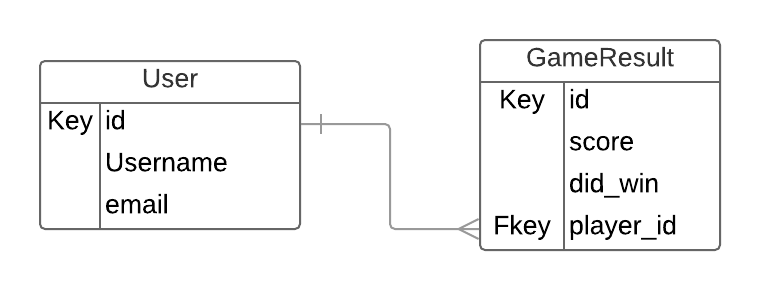

# Active Record Practice Exercises - Validations

The following two models are to be used in an online game application.



## Section 1 Validations

1.1  Modify the model to add the following validations.

```ruby
# app/models/user.rb
class User < ApplicationRecord

    # Username must be unique and present


   # Email must include an '@' (see https://goo.gl/NYSL2z)


end
```


```ruby
# app/models/gameresult.rb
class GameResult < ApplicationRecord

  # Score must be numeric and nonnegative


end
```

## Section 2 Fixtures

2.1  Create 2 fixtures for each model.

```yml
# /test/fixtures/user.yml


```

```yml
# /test/fixtures/gameresult.yml


```


## Section 3 - Testing Validations

3.1  Using the fixtures above write the following test.

```ruby
describe "User" do
  it "must have a unique username" do


  end
end
```
